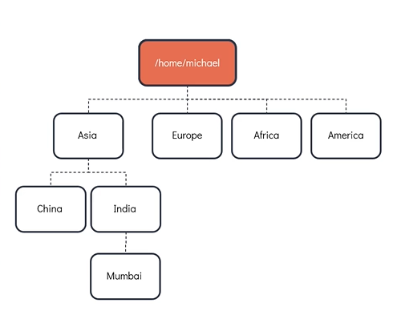
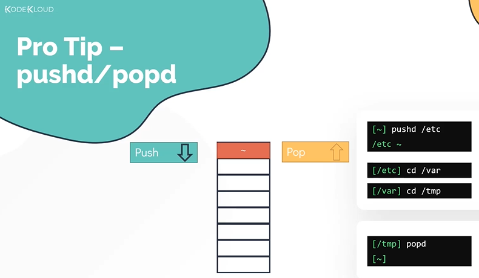
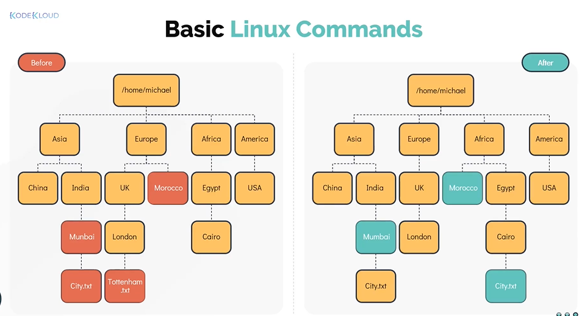

# Basic Linux Commands

- Take me to the [Video Tutorial](https://kodekloud.com/topic/basic-linux-commands-3/)

In this section, we will take a look at basic linux commands 
- Specifically related to navigation and creating new files and directories.
- We will do this by completing a simple task using a linux shell.

#### Our goal is to create a directory structure, the top most directory which is **`/home/michael`** which is already created as it as a home directory but everything else underneath has to be created. 



To print the present working directory. Run **`pwd`** command
```
$ pwd
```

To see the contents of the directory. Run **`ls`** command
```
$ ls 
````

To make (or) create a directory. Run **`mkdir`** command
```
$ mkdir Asia
```

To make (or) create multiple directories. Run **`mkdir`** command followed by **`<directory_name1> <directory_name2> .. <directory_nameN>`**
```
$ mkdir Europe Africa America
```

To change a directory from the current directory. Run **`cd <directory_name>`**
```
$ cd Asia
```

To recursively created directories. Run **`mkdir -p <directory_name1>/<sub_directory_of_name1>`**
```
$ mkdir -p India/Mumbai
```

To go back to one directory up. Run **`cd ..`**
```
$ cd ..
```

To go back directly to a home directory of the current user from any location in the system. Run **`cd`**
```
$ cd
```

#### Lets now look at absolute path and relative path


**Difference Between Absolute and Relative Path**

- **Absolute Path** : An absolute path is defined as specifying the location of a file or directory from the root directory(/).
- **Relative Path** : Relative path is defined as the path related to the present working directly(pwd).

To change to a directory with absolute path. Run **`cd <directory_path>`**
```
$ cd /home/michael
```

To Change to a directory with relative path. Run **`cd <directoryName>`**
```
$ cd Asia
```

#### Lets now take a look at alternatives to the **`cd`** command



Alternative to the **`cd`** is the **`pushd\popd`** command. To change directory using pushd, run **`pushd <directory_name>`**
```
$ pushd /etc
```

You can change to subdirecties under /etc as many times as you wish
```
$ pushd /var
$ pushd /tmp
$ pwd
/etc/var/tmp
```

To return back to origin directory(say your home directory), use the **`popd`** command
```
$ popd
```

#### Now lets move on to look some more basic commands in linux. To learn these commands we will make use of the same directory structure as before, however now there are some new files and directories added as shown in the diagram. The goal of this task is to make sure the directory structure looks like the below diagram .



To move file or directory. Run **`mv <source> <destination>`** command
```
$ mv /home/michael/Europe/Morocco /home/michael/Africa/ (Absolute path)
$ mv Europe/Morocco Africa/ (Relative Path)
```

To rename a directory. Run **`mv <oldname> <newname>`** command
```
$ mv Asia/India/Munbai Asia/India/Mumbai
```

To copy a file to a directory. Run **`cp <filename> <destination_directorypath>`** command
```
$ cp Asia/India/Mumbai/City.txt Africa/Egypt/Cairo
```

To delete a file from a directory. Run **`rm /path/<filename>`** command
```
$ rm Europe/UK/London/Tottenham.txt
```

To copy a directory recursively. Run **`cp -r <sourcepath> <destinationPath>`** command
```
$ cp -r Europe/UK Europe/UnitedKingdom
```

To print the content of a file. Run **`cat /path/to/<filename>`** command
```
$ cat Asia/India/Mumbai/City.txt
```

To add a content to a file with cat(redirect) . Run **`cat > /path/to/<filename>`** command
```
$ cat > Africa/Egypt/Cairo/City.txt
  Cairo
  `Type Ctrl + d from keyboard`
```

To create an empty file. Run **`touch /path/to/filename`** command
```
$ touch /home/michael/Asia/China/Country.txt
```

To see the content of a file in a scrollable manner. Run **`more /path/to/filename`** command <-- not recommended for large files
```
$ more new_file.txt
```

To see the content of a file and navigate throught the file. Run **`less /path/to/filename`** command
```
$ less new_file.txt
```

To get the long list of files and directories. Run **`ls -l`** command
```
$ ls -l
```

To list all files including the hidden. Run **`ls -la`** command
```
$ ls -a
```

To list all the files in the order they were modified. Run **`ls -lt`** command
```
$ ls -lt
```

To list all the files form oldest to newest. Run **`ls -ltr`** command
```
$ ls -ltr
```

