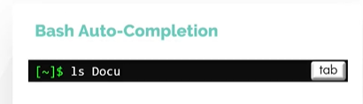
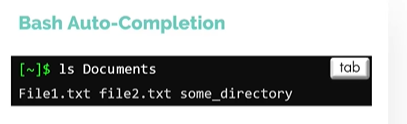
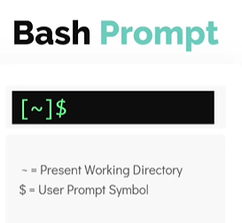
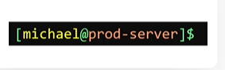
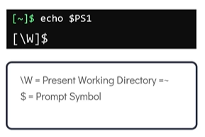

# Bash Shell

- Take me to the [Video Tutorial](https://kodekloud.com/topic/bash-shell/)

## Different types of Shells

In this section, we will take a look at different types of shells.
- There are different types of shells in linux, some of the popular ones are below
  - Bourne Shell (sh)
  - C Shell (csh or tsh)
  - Korn Shell (ksh)
  - Z Shell (zsh)
  - Bourne again shell (Bash)
  
To check the shell being used. Use the command **`echo $SHELL`**
```
$ echo $SHELL
```

To change the default shell. Use the command chsh, you will be prompted for the password and following that input the name of the new shell. You have to login into new terminal session to see this change though.
```
$ chsh
```

## Bash Shell Features

1. Bash supports command auto-completion. What this means is bash means to auto-complete commands for you if you type part of it and press the **`tab`** key
   
   
   
   

1. In Bash we can set custom aliases for the actual commands
   ```
   $ date
   $ alias dt=date
   $ dt
   ```
1. Use the **`history`** command to list the previous run commands that you ran earlier
   ```
   $ history
   ```
   
 ## Bash environment variables
 
 To print **`SHELL`** environment variable
 ```
 $ echo $SHELL
 ```
 
 To see a list of all environment variables. Run **`env`** from the terminal
 ```
 $ env
 ```
 
 To set an environment variable with in the shell. The value is not carry forward to any other process.
 ```
 $ OFFICE=caleston
 ```
 
 To set an environment variable we can use the **`export`** command. To make the value carry forward to any other process. 
 ```
 $ export OFFICE=caleston
 ```
 
 To persistently set an environment variable over subsequent login or a reboot add them to the **`~/.profile`** or **`~/.pam_environment`** in the users home directory.
 
 ```
 $ echo "export OFFICE=caleston" >> ~/.profile (or)
 $ echo "export OFFICE=caleston" >> ~/.pam_environment
 ```
 
 To check the value of a environment variable called **`LOGNAME`**
 ```
 $ echo $LOGNAME
 ```
 
## Path Variable

#### Speaking about the environment variables, when a user issues an external command into the shell, the shell uses path variable to search for these external commands
 
To see the directories defined in path variable. Use the command **`echo $PATH`**.
```
$ echo $PATH
```

To check if the location of the command can be identified. Use the **`which`** command

**`Syntax: which <command>`**

```
$ which obs-studio
```

To define a command in the **`PATH`** variable. To add we can use the **`export`** command.
```
$ export PATH=$PATH:/opt/obs/bin
$ which obs-studio
```

## Customize Bash Prompt

Once you login into the shell, the line you see is the bash prompt.



It can be customized to see the **`username`** and the **`hostname`**



#### The bash prompt is set in control by a set of special shell environment variables. The most common of these and the one we will focus on is **`PS1`** variable.



To see the value assign to **`PS1`**, type **`echo $PS1`**
```
$ echo $PS1
```

To change the PS1 to only display the word **`ubuntu-server`**.
```
$ PS1="ubuntu-server"
$ echo $PS1
```

#### To customize further, have a look at the below special character.


To change the bash prompt to display **`date`**, **`time`**, **`username of the current user`**, the **`hostname`** and the **`current working directory`**
```
$ PS1="[\d \t \u@\h:\w ] $ "
```
