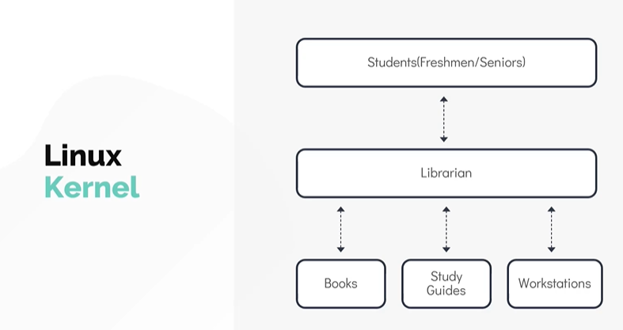
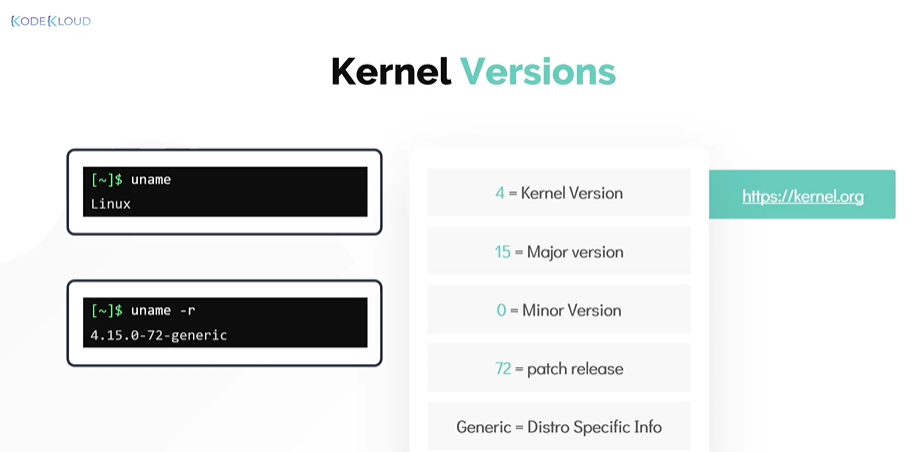
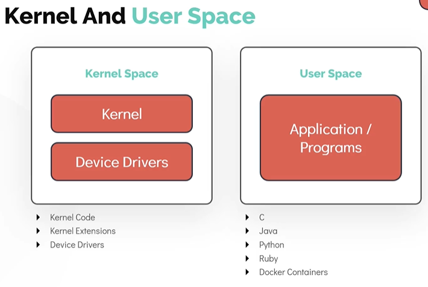
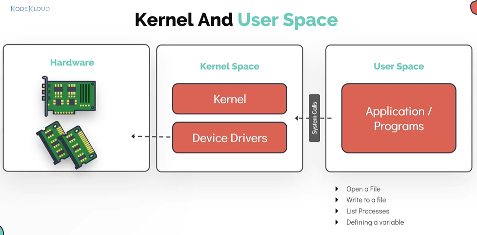
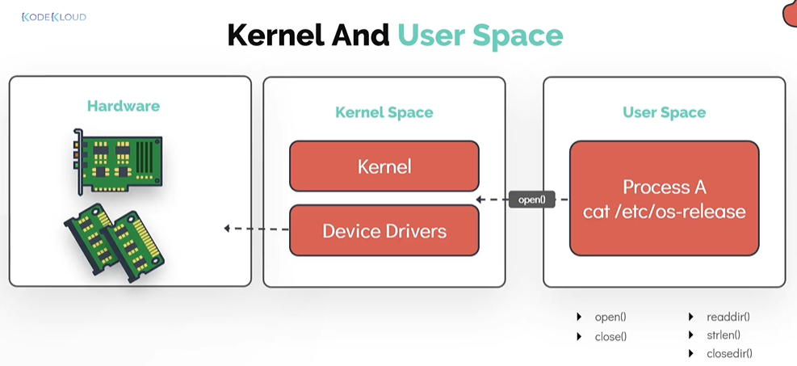

# Linux Core Concepts

- Take me to the [Video Tutorial](https://kodekloud.com/topic/linux-kernel/)

In this section, we will take a look at the core concepts of a linux operating system.
- We will start with introduction to the linux kernel.
- We will then learn about the kernel space and user space.

## Linux Kernel

#### If you have worked with any operating system, you have run into the term kernel. 

- The Linux kernel is monolithic, this means that the kernel carrries out CPU scheduling, memory management and several operations by itselfs. 
- The Linux Kernel is also modular, which means it can extends its capabilities through the use of dynamically loaded kernel modules

  

#### To understand a kernel in simple terms, let us use an analogy of a **`College Library`**. Here the librarian is equal to Linux Kernel.



#### The Kernel is responsible for 4 major tasks

1. Memory Management
1. Process Management
1. Device Drivers
1. System calls and Security

## Linux Kernel Versions

#### let us know identify the ways to identify linux kernel versions

Use **`uname`** command to get the information about the kernel (by itself it doesn't provide much information except that the system uses the **`Linux`** Kernel.
```
$ uname
```

Use the **`uname -r`** or **`uname`** comamnd and option to print the kernel version
```
$ uname -r
$ uname -a
```
   

## Kernel and User Space

#### One of the important functions of the linux kernel is the **`Memory Management`** . We will now see how memory is seperated within the linux kernel

Memory is divded into two areas.
1. Kernel Space
   1. Kernel Code
   1. kernel Extensions
   1. Device Drivers
1. User Space
   1. C
   1. Java
   1. Python
   1. Ruby e.t.c
   1. Docker Containers
   


#### Let us know see how programs running in the `User Space` work

All user programs function by manipulating data that is stored in memory and on disk. User programs get access to data by making special request to the kernel called **`System Calls`**
- Examples include, allocating memory by using variables or opening a file.

  

- For example, opening a file such as the **`/etc/os-release`** to see the operating system installed, results in a **`system call`**

  


