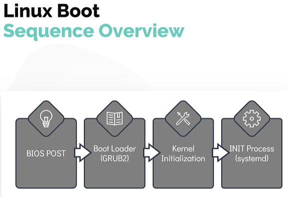
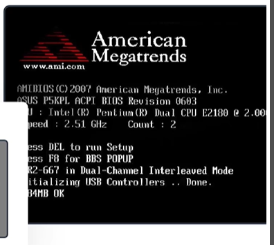
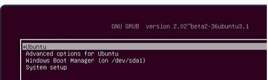
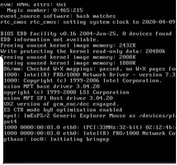

# Linux Boot Sequence

- Take me to the [Video Tutorial](https://kodekloud.com/topic/linux-boot-sequence/)

In this section, we look at the boot process in a simplied manner by dividing it into four broader steps.
- The boot process can be broken down into four stages
  1. BIOS POST
  1. Boot Loader (GRUB2)
  1. Kernel Initialization
  1. INIT Process
  
  
  
 #### How to initiate a linux boot process?
  - This can be achieved in one of the two ways.
    - The first method is to start a linux device which is in a halted or stopped state 
    - Second method is to reboot or reset a running system
    
 #### BIOS POST
 
 - The first stage, called **`BIOS POST`** has very little to do with linux itself.
 - **`POST`** Stands for **`Power On Self Test`**.
 - In this stage, BIOS runs a POST test, to ensure the hardware components that are attached to the device are functioning correctly, if POST fails the computer may not be operable and the system will not be proceed to next stage of the boot process
 
 
 
 #### Boot Loader
 - The next stage after BIOS POST is **`Boot Loader`** after successful of POST test.
 - BIOS loads and executes the boot code from the boot device, which is located in the first sector of the harddisk. In Linux this is located in the **`/boot`** file system.
 - The boot loader will provide the user with the boot screen, often with multiple options to boot into. Such as Microsoft windows O.S or Ubuntu 18.04 O.S in an example of a dual boot system.
 - Once the selection is made at the boot screen, boot laoder loads the kernel into the memory supplies it with some parameters and handsover the control to kernel
 - A popular example of the boot loader is **`GRUB2`** (GRand Unified Bootloader Version 2). Its a primary boot loader now for most of the operating system.
 
 
 
 #### Kernel Initialization
 - After the selected kerenl is selected and loads into the memory, it usually decompress and then loads kernel into the memory.
 - At this stage, kernel carries out tasks such as initializing hardware and memory management tasks among other things.
 - Once it is completely operational , kernel looks for **`INIT Process`** to run. Which sets up the **`User Space`** and the process is needed for the environment.
 
 
 
 #### INIT Process
 
 - In most of the current day linux distribution, the **`INIT`** function then calls the **`systemd`** daemon.
 - The **`systemd`** is responsible for bringing the linux host to usable state.
 - **`systemd`** is responsible for mounting the file systems, starting and managing system services.
 - **`systemd`** is the universal standard these days, but not too  long ago another initialization process called **`system V (five) init`** was used. It is also called **`Sys5`
   - For example these were used in **`RHEL 6`** or **`CentOS 6`** distribution
 - Once of the key advantages of using **`systemd`** over **`system V(five) init`**  is that it reduces the system startup time by parallelizing the startup of services.
 
 To check the **`init`** system used run **`ls -l /sbin/init`**, if it is systemd then you will see a pointer to **`/lib/systemd/systemd`**
 ```
 $ ls -l /sbin/init
 ```
 
