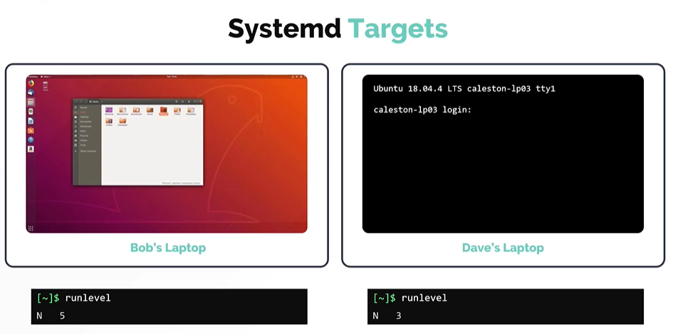
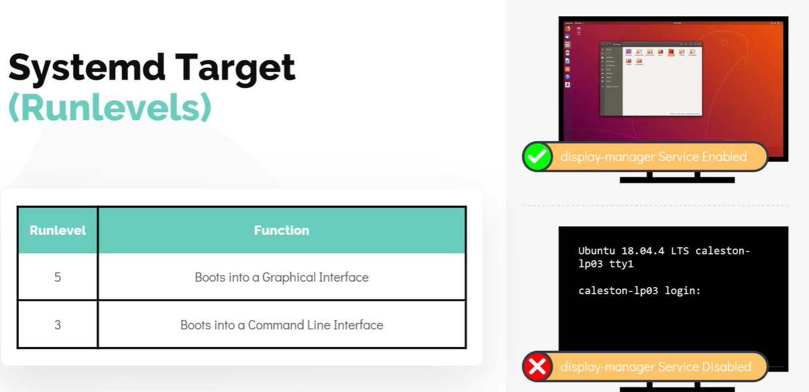
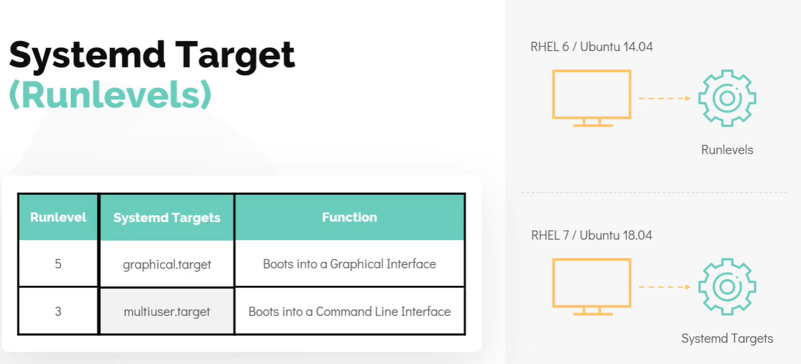

# Run Levels

- Take me to the [Video Tutorial](https://kodekloud.com/topic/runlevels/)

## Systemd Targets (Run Levels)

We can setup the server to boot either into graphical mode or non-graphical mode. Linux can run in multiple modes and these modes are set by something called **`runlevel`**
- The operation mode which provide a graphical interface is called **`runlevel 5`**
- The operation mode which provide a non-graphical mode is called **`runlevel 3`**

   

To see the operation mode run in the system. Run the command **`runlevel`** from the terminal
```
$ runlevel
```

During boot, the **`init`** process checks the **`runlevel`**, it make sure that all programs need to get the system operation in that mode are started.
  - For example: The **`Graphical User`** mode requires a **`display manager`** service to run for the GUI to work, however this service is not required for the **`non-graphical mode`**

    

In the boot process section, we saw that the **`systemd`** is used as the **`init`** process in most new linux distributions suchs as **`Ubuntu 18.04`**.
- In **`systemd`**, runlevels are called as **`targets`**.
  - The RunLevel 5 is called as the **`graphical target`** 
  - The Runlevel 3 is called as the **`multiuser target`**
  
    

#### Now that we are familiar with runlevels in systemd target unit. Lets now take a look at how we change these values from a shell.

To see the default target, run the command **`systemctl get-default`**. This command looks at the file located at **`/etc/systemd/system/default.target`** 
```
$ systemctl get-default
```

To change the default target, we can make use of **`systemctl set-target <desired target name goes here as an argument>`**
```
$ systemctl set-default multi-user.target 
```


