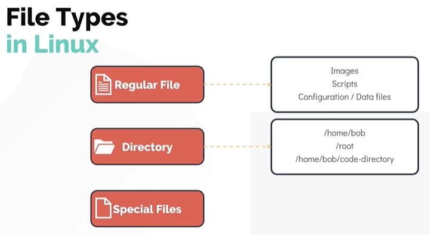
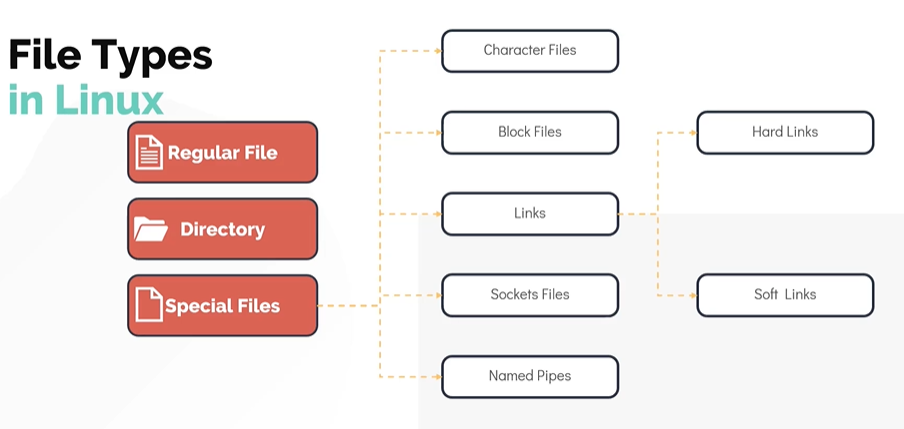
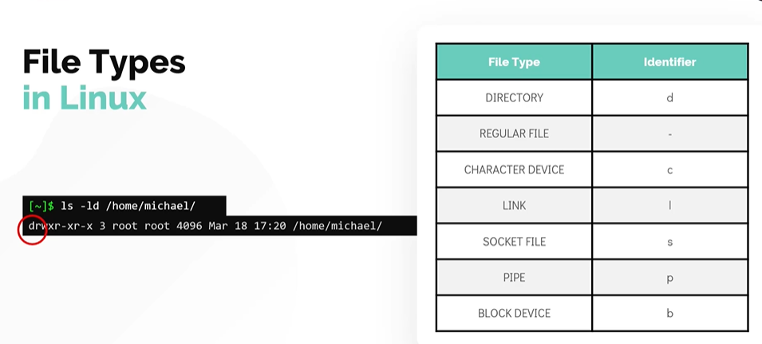

# File Types in Linux

- Take me to the [Video Tutorial](https://kodekloud.com/topic/file-types/)

In this section, we will take a look at different types of files in linux.
- Everything is a file in Linux. 
  - Every object in linux can be considered to be a type of file, even a directory for example is a special type of file.

There are three types of files.
1. Regular File
1. Directory
1. Special Files



**`Special files`** are again catagorized into five other file types.
1. Character Files
   - These files represent devices under the **`/dev`** file system.
   - Examples include the devices such as the **`keyboard`** and **`mouse`**.
1. Block Files
   - These files represent block devices also located under **`/dev/`** file system.
   - Examples include the **`harddisks`** and **`RAM`**
1. Links
   - Links in linux is a way to associate two or more file names to the same set of file data.
   - There are two types of links
     - The Hard Link 
     - The Soft Link
1. Sockets
   - A sockets is a special file that enables the communication between two processes.
1. Named Pipes
   - The Named Pipes is a special type of file that allows connecting one process as an input to another  
   
     
     
#### Let us now see how to identify different file types in Linux.
 
One way to identify a file type is by making use of the **`file`** command. 
```
$ file /home/michael
$ flle bash-script.sh
$ file insync1000.sock
$ file /home/michael/bash-script
```

Another way to identify a file type is by making use of the **`ls -ld`** command
```
ls -ld /home/michael
ls -l basg-script.sh
```
   

