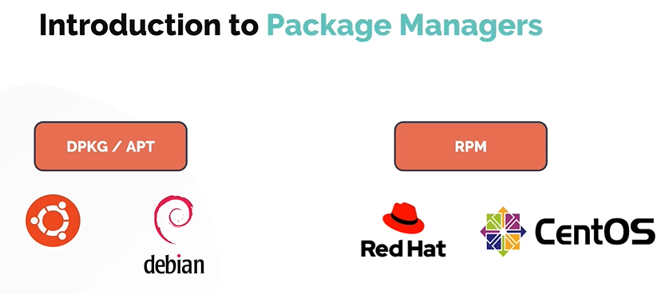
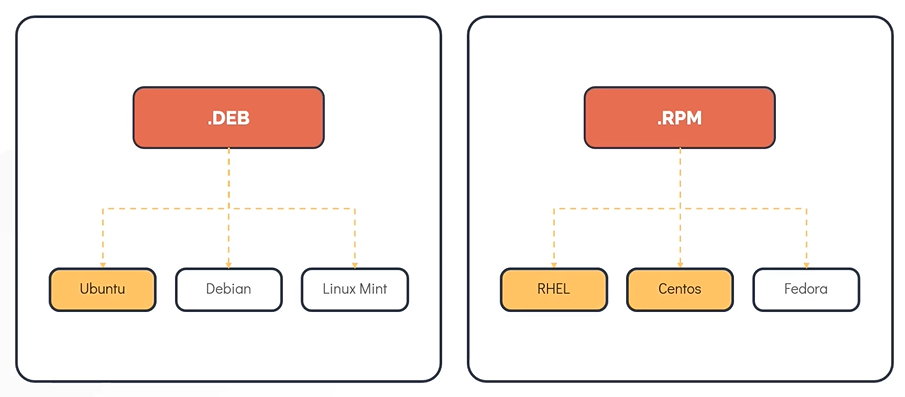
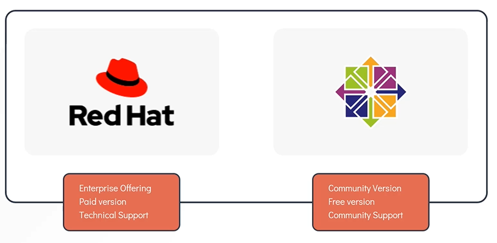
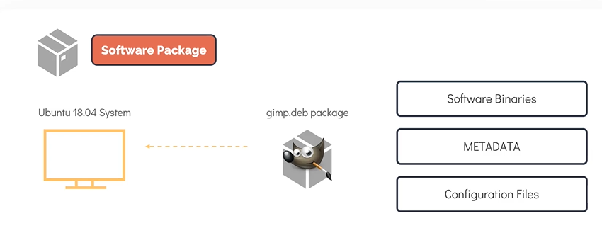
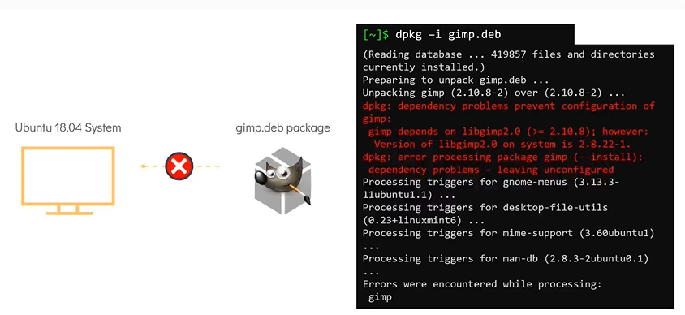
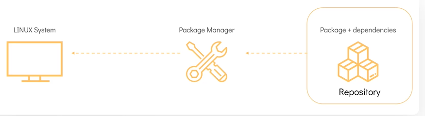
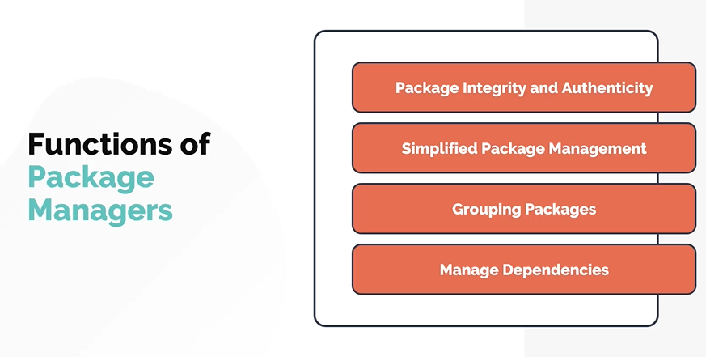
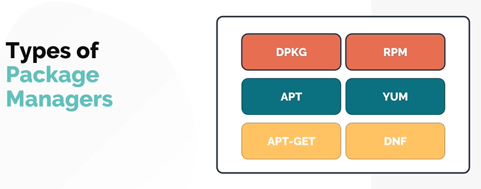

# Package Management Distribution

- Take me to the [Video Tutorial](https://kodekloud.com/topic/package-management-introduction/)

In this section, we will take a look at the Linux Package Management tools used in different linux distribution
- Will start with introduction to the package management.

## Introduction to Package Managers

For **`Debain/Ubuntu`**, it is **`apt/dpkg`** and for CentOs/Redhat, it is **`RPM`**

**Question** : What is the difference between **`CentOS`**, **`RHEL`** and **`Ubuntu`***?
- There are hundreds of Linux distributions in use today

One of the common ways to catagorize linux distribution is by the package manager it uses.
- For example: Distributions such as **`RHEL`**, **`Fedora`** and **`CentOS`**. are based on RPM. Hence they are known as **`RPM`** based distribution. The **`Debian`** family including **`Ubuntu`**, **`Debian`** and **`Linux Mint`** e.t.c. make use of **`Debian`** based package managers such as the **`DPKG`**. 

#### Now, Lets compare **`RHEL`** and **`CentOS`** Operating Systems.

#### What is a package?
- A package in its simplest defination is a compressed archieve that contains all the files that are required by a particular software to run.
- For example: Lets consider an Ubuntu System, we want to install a simple editing system such as **`gimp`** which stands for **` GNU Image Manipulation System`**. To do this, we can make use of the **`gimp.deb`** package which contains all the software binaries and files needed to for the image editor to run along with the metadata which provides the information about the software itself.

#### Thats seems to be a quite easy process, why don't we do all the time? download a package and install it on a linux servers. Wondering the need of package managers?
- There are hundreds of linux distributions are there, these distributions runs different sets of tools and libraries, software and possibly even different linux kernels as a result of this a linux program may not run the same way from one system to another. To fix this problem packages include a manifest of dependencies or list of programs in versions that must be satified for the package software to run correctly on a given computer.
- Take a look at the errors in the installation while attempting to install **`gimp.deb`** on this ubuntu 18.04 system, the dependencies failed as a result the installations failed. Bare in mind that each of these dependent packages may have dependencies of their own which makes package installation management a very tedious process. This is where a **`Package Manager`** comes into save the day.

  
  
#### A package manager is a software in a linux system that provides the consistent and automated process in installing, upgrading, configuring and removing packages from the operating system.

## Functions of Package Manager

## Types of Package Managers

A Linux distribution supports different types of package managers, some of the common ones are below

