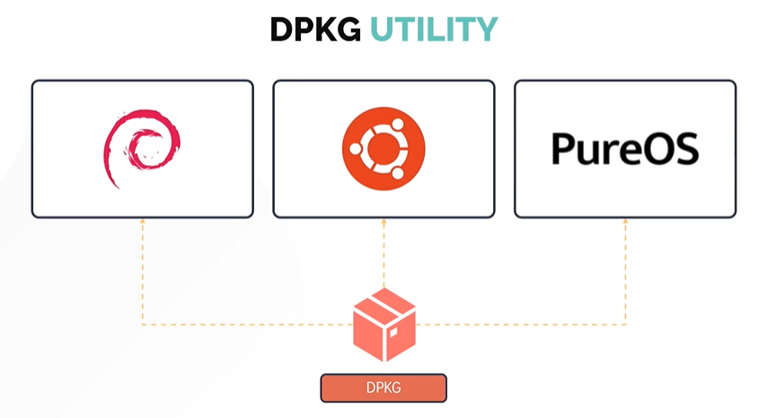
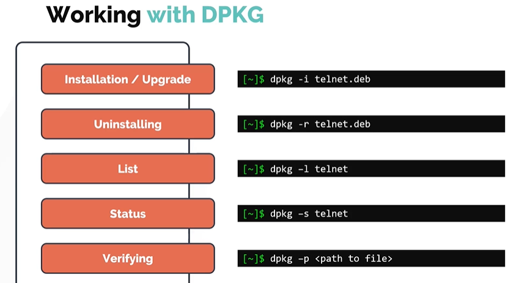
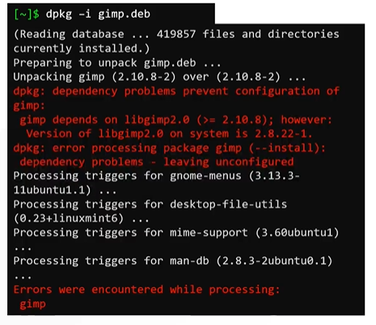
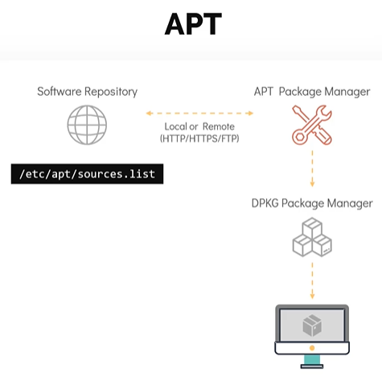

# DPKG and APT Package Managers

- Take me to the [Video Tutorial](https://kodekloud.com/topic/dpkg-and-apt/)

In this section, we will look at debian package managers for distributions like **`Ubuntu`**, **`Debian`** and **`PureOS`**.
- DPKG
- APT

## DPKG Utility

- DPKG stands for Debian Package Manager
- It is a low level package manager



#### Working with DPKG

Similar to RPM, DPKG can be used for the below. The package extension is .deb.
1. Installing
1. Uninstalling
1. Upgrade
1. List
1. Status
1. Verfiying

   
   
## APT and APT-GET

Similar to RPM, DPKG doesnt resolve the dependencies when it comes to package management.
- Install may fail due to dependencies issues. This is the reason why we use higher level debian package managers such as **`APT`** and **`APT-GET`**.
  
  
  
- Instead of relying on DPKG, you can install software along with its dependencies using **`APT`** or **`APT-GET`**.
- **`APT`** or **`APT-GET`** although sounds similar, but they do not depend on each other.
- **`APT`** stands for advanced package managers, it is more user friendly and overall better tool compared to **`APT-GET`**.
  ```
  $sudo apt install gimp
  $sudo apt-get install gimp
  ```

- APT act as a frontend package manager that relies on DPKG utility. In similar to YUM, APT relies on software repository that contains packages that would eventually be installed on a system.
- The software repository for APT is defined in **`/etc/apt/sources.list`**  file.

  
  
#### Let us know see some common commands

To refresh a repository. Run **`apt update`** command.
```
$ sudo apt update
```

To install available upgrades of all packages currently installed on the system from the sources configured.
```
$ sudo apt upgrade
```

Another way to update the repository is to use **`apt edit-sources`** command. This opens up the **`/etc/apt/sources.list`** file in the text editor of your choice.
```
$ sudo apt edit-sources
```

To install the package
```
$ sudo apt install telnet
```

To remove the package
```
$ sudo apt remove telnet
```

To search or look for a package in the repository.
```
$ sudo apt search telnet 
```

To list all the available packages 
```
$ sudo apt list |grep telnet
```


