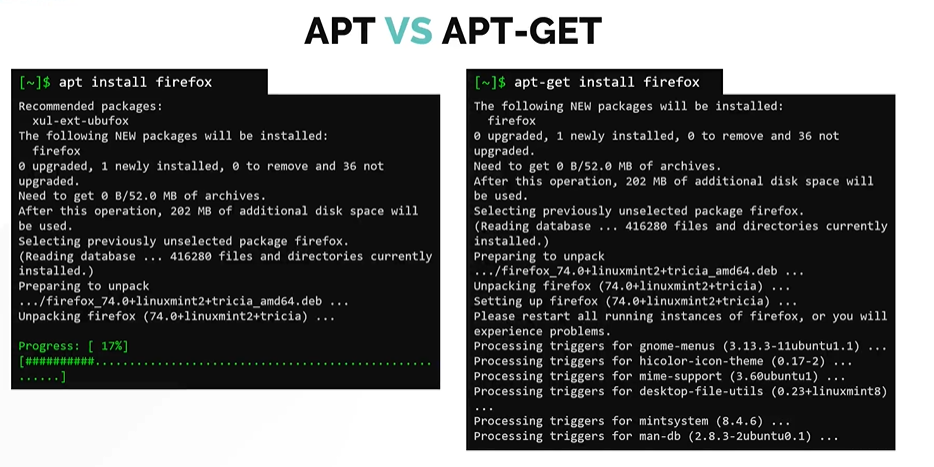
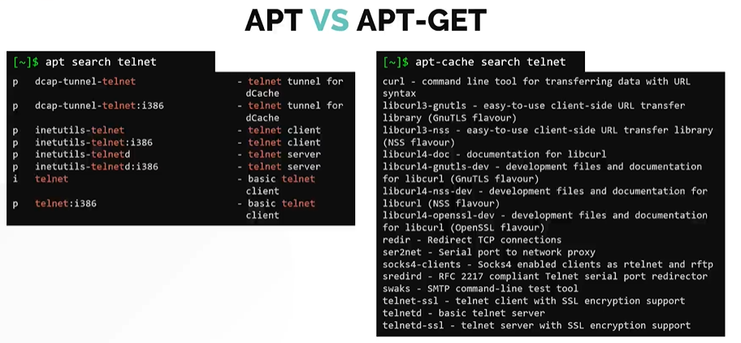

# APT vs APT-GET

- Take me to the [Video Tutorial](https://kodekloud.com/topic/apt-vs-apt-get/)

#### Difference between APT vs APT-GET
- APT is a more user friendly tool when compared to APT-GET
- In all the latest debian based distros APT is already installed by default.

#### Lets take a look why **`APT`** is better when compare to **`APT-GET`**

Lets try to install **`firefox`** package using both APT and APT-GET
- You will notice APT does easy on the eyes, you get just enough information and also a nice little progress bar
- APT-GET is just effective and doesn't provide the output in user-friendly format.

  
 
Lets try another comparision by search a **`telent`** package.
- You will notice with apt, all its options are located in one place. You can search with **`apt search telnet`** command.
- On the other hand, you cannot use search command with **`apt-get`** command. Instead, you have to use another tool called **`apt-cache search telnet`**.
- If you compare the results of the two commands, you will also see the **`apt-cache`** throws in a lot of extra information in the search result, which may not be really useful for the end user.

  
 
