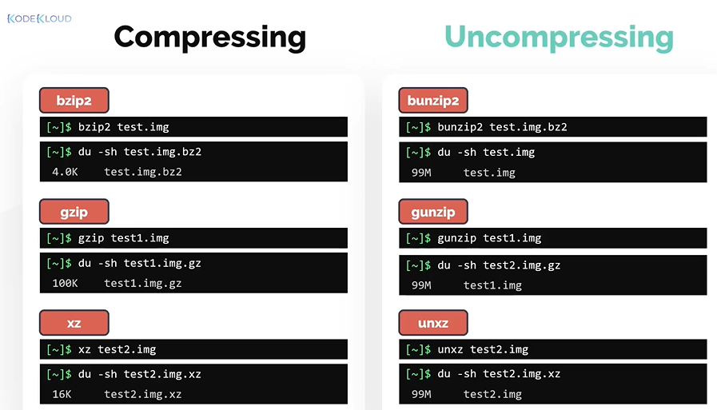
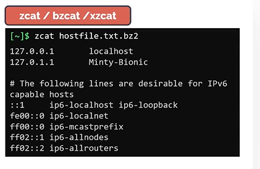

# File Compression and Archival

- Take me to the [Video Tutorial](https://kodekloud.com/topic/file-compression-and-archival/)

In this section, we will take a look to compress and archive files
- File Compression and Archival

## Viewing file sizes

The **`du`** command, which stands for **`disk usage`** is a popular command to inspect the size of the file.
- **`du`** with **`-sk`** shows the size of a file or directory in **`Kilobytes`**
  ```
  $ du -sk test.img
  ```  
  
- **`du`** with **`-sh`** shows the size of a file or directory in **`human readable format`**
  ```
  $ du -sh test.img
  ```
  
- we can also use **`long list`** , **`ls -lh`** to print the size of the file.
  ```
  $ ls -lh test.img
  ```
  
## Archiving Files

Let us know take a look at widely used utility called **`tar`** 
- **`tar`** is used to group multiple files and directories into a single file. Hence it is specially used for archiving data.
- tar is an abrevation for **`tape archive`**.
- Files created with tar are often called **`tarballs`**.

To archive a file or directory. Use **`tar`** command followed by **`-c`** to create an archive and the **`-f`** is used to specify the name of the tar file to be created. These is followed by files or directories to be archive.
```
$ tar -cf test.tar file1 file2 file3 
$ ls -ltr test.tar
```

The **`tar`** command followed by **`-tf`** option followed by the tar filename is used to see the contents of the tarball.
```
$ tar -tf test.tar
```

The **`tar`** command followed by **`-xf`** option followed by the tar filename is used to extract the contents from the tarball.
```
$ tar -xf test.tar
```

The **`tar`** command followed by **`-zcf`** option is used to compress the tarball to reduce its size.
```
$ tar -zcf test.tar
```

## Compression

Compression is the technique used to reduce the size consumed by a file or a dataset.
- To reduce the size of a file or directory in the linux file system, there are commands specificly used for compression. 
- Let us now look at the three popular ones
  - bzip2 (.bz2 extension)
  - gzip (.gz extension)
  - xz (.xz extension)
    
    ```
    $ bzip2 test.img
    $ gzip test1.img
    $ xz test2.img
    ```
  
#### The space of the compressed files created by these three commands depends on a few factors, such as the type of data being compressed, the other factors that effect the size are the compression algorithm used by these commands and the compression level used.

- The compressed files can be uncompressed by using the below commands
  - bunzip2
  - gunzip
  - unxz
    ```
    $ bunzip2 test.img
    $ gunzip test1.img
    $ unxz test2.img
    ```
  
     
    
#### Compressed files need not to be uncompressed everytime
- Tools such as **`zcat`** , **`bzcat`** and **`xzcat`** allow the compressed files to be read without an uncompress
  ```
  $ zcat hostfile.txt.bz2
  $ zcat hostfile.txt.gz
  $ zcat hostfile.txt.xz
  ```
     


