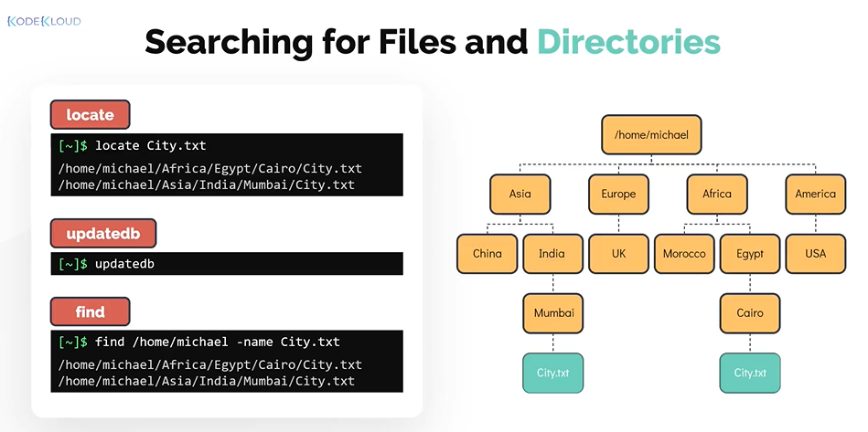
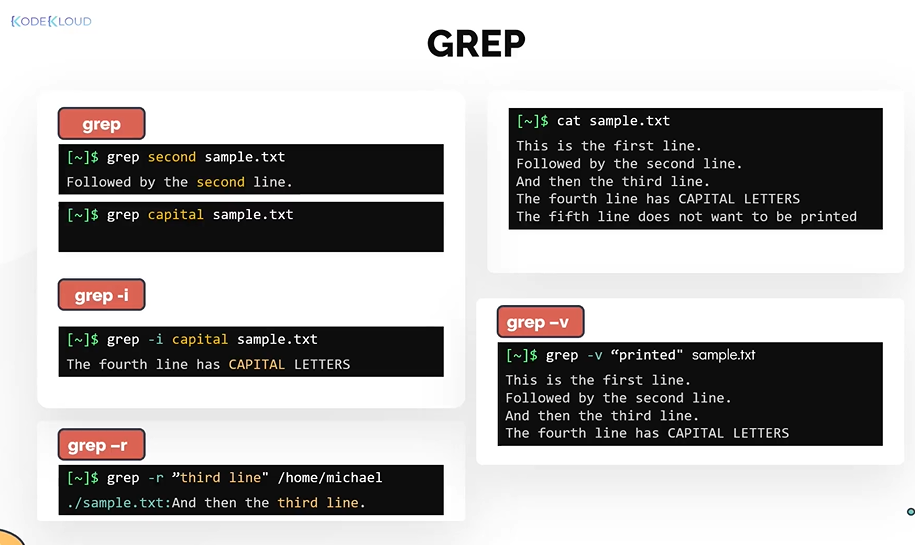
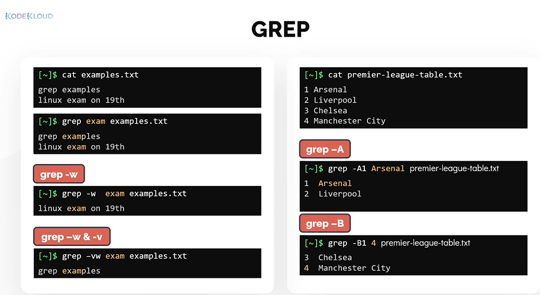
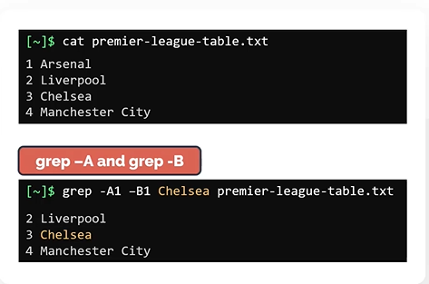

# Searching for files and Patterns

- Take me to the [Video Tutorial](https://kodekloud.com/topic/searching-for-files-and-patterns/)

In this section, we will take a look at how to locate a file or directory in the filesystem.
- locate
- find
- grep

## locate
Lets say you want to find the files with the name **`City.txt`**. Easiest way to do this is to make use of **`locate`** command.
- Run **`locate`** command followed by the filename you are searching as an argument. This should return all paths matching the pattern.
  ```
  $ locate City.txt
  ```

- The downside of the locate command is it depends on a database called **`mlocate.db`** for querying the filename.
- If you have just installed linux or if the file you are trying to locate was created recently. The locate command may not give you useful results. This is because it is possible that the DB is not been updated yet.
- To manually update the DB, run the command **`updatedb`** and then run the locate command again
  ```
  $ sudo updatedb
  ```
- Please note that the **`updatedb`** command needs to be run as root user to work.

## find

Another way to do this is make use of the **`find`** command. Use the find command followed by the directory under which you want to search. To search file by a name use the **`-name`** option followed by the name of the file.
```
$ find /home/michael -name City.txt
```
   
   
## Grep

To search within files, the most popular command in linux is grep. 
- Grep is commonly used to print lines of a file matching a pattern but it also offers a variety of other options as well.
- The grep command is case-sensitive  

To search for the word **`second`** from the **`sample.txt`**
```
$ grep second sample.txt
```

To search for the word **`capital`** with **`case-insensitive`** use **`-i`** flag.
```
$ grep -i capital sample.txt
```

To search for a pattern recursively.
```
$ grep -r "thrid Line" /home/michael
```

To print the lines that don't matches the pattern
```
$ grep -v "printed" sample.txt
```

  
  
#### What if you want to match a pattern that form a whole word?

To search for the whole word called **`exam`**. Use **`grep`** followed by **`-w`** flag  
```
$ grep -w exam examples.txt
```

You can also combine multiple options together. For example, to reverse the search and print all lines of the same file that doesn't match the whole word exam. Use **`grep -vw`** 
```
$ grep -vw exam examples.txt
```

To print the number of lines after and before matching a pattern. Use **`grep`** command with **`-A`** and **`-B`** flags respectively.
```
$ grep -A1 Arsenal premier-league-table.txt
$ grep -B1 4 premier-league-table.txt
```

   


Finally, the **`-A`** and **`-B`** can be combined into one single search.
```
$ grep -A1 -B1 Chelsea premier-league-table.txt
```
  
   


  
