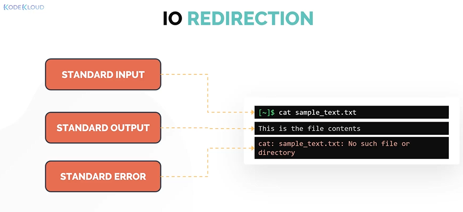
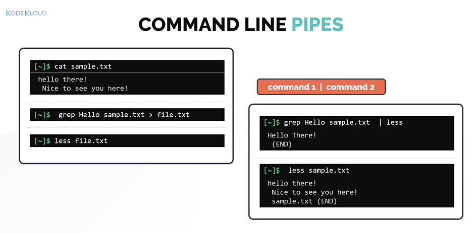
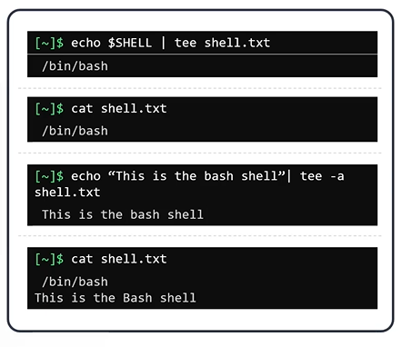

# IO Redirection

- Take me to the [Video Tutorial](https://kodekloud.com/topic/io-redirection/)

In this section, we will take a look at IO **`Redirection`**.
- IO Redirection
- Standard Streams in Linux

There are three data streams created when you launch a linux commnad.
- Standard Input (STDIN)
  - STDIN is the standard input stream which accepts text as an input.
- Standard Output (STDOUT)
  - Text output is delivered as STDOUT or the standard out stream
- Standard ERROR (STDERR)
  - Error messages of the command are sent through the standard ERROR stream (STDERR)
  
  
  
With IO Redirection, the STDIN, STDOUT and STDERR can be redirected to a text file.

## REDIRECT STDOUT

To redirect STDOUT to a file instead of printing it on the screen.
```
$ echo $SHELL > shell.txt
```

To append STDOUT to an exisiting file
```
$ echo $SHELL >> shell.txt
```

## REDIRECT STDERR

To redirect just the ERROR message we need to use **`2`** followed by forward arrow **`>`** symbol and then the name of the filename in which the errors are written.
```
$ cat missing_file 2> error.txt
```

To append the STDERR to the exisiting file
```
$ cat missing_file 2>> error.txt
```

If you want to execute and not print ERROR messages on the screen even if it generates a standard ERROR. You can redirect to **`/dev/null`** 
```
$ cat missing_file 2> /dev/null
```

## Command Line Pipes

Command Line Pipes allow the linking of multiple commands.
- In simple terms, pipes allows the first commands standard output to be used as the standard input for the second command.
- The pipes are defined using vertical bar symbol (|).

  ```
  $ grep Hello sample.txt | less 
  ```
    
    
Another command to work with STDIN and STDOUT is the **`tee`** command.
- Instead of the redirect operator, we can use the command line pipe **`(|)`** followed by **`tee`** command.
  ```
  $ echo $SHELL | tee shell.txt
  ```
     
 - Use **`tee`** with -a option, to append instead of overwritting it
   ```
   $ echo "This is the bash shell" | tee -a
   ```
   
      
  
