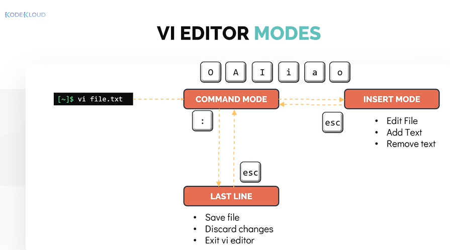
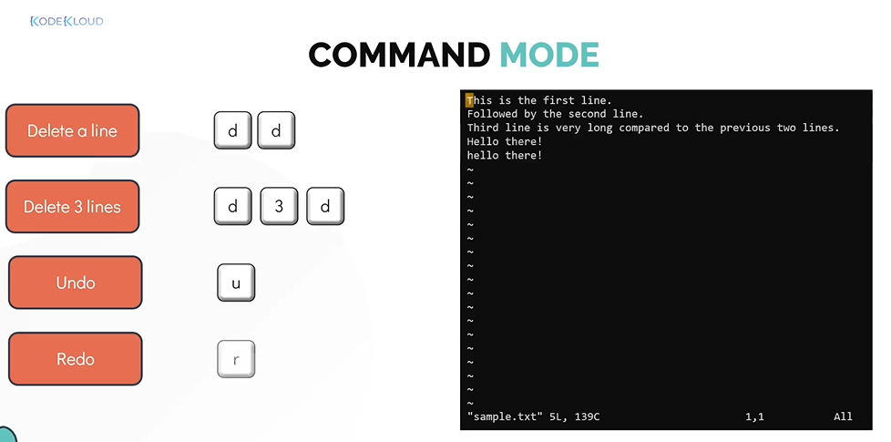
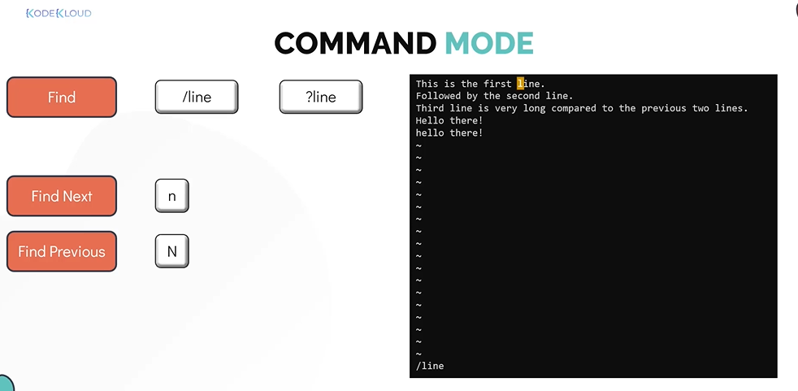
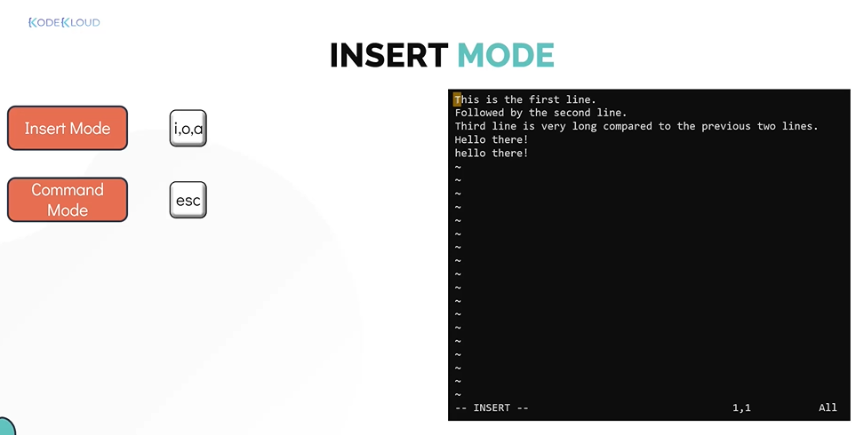
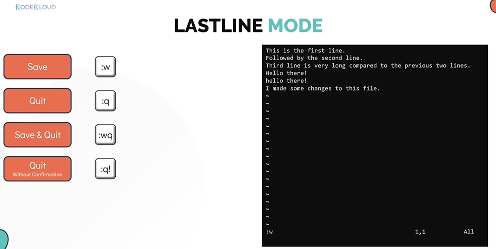
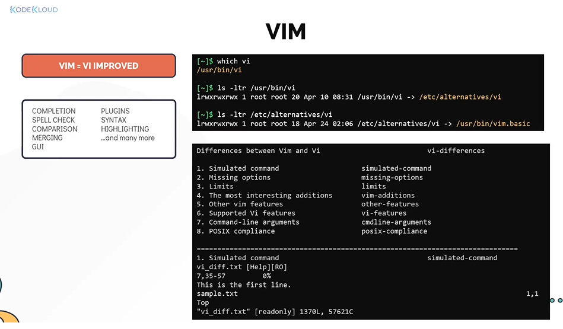

# Vi Editor

- Take me to the [Video Tutorial](https://kodekloud.com/topic/vi-editor/)

In this section, we will take a look at console based text editors in linux.
- It is not feasible using **`cat`** when dealing with large amounts of text or for writing code. This is why we use text editors

## Text Editor

There are several options available, we will be focusing on the **`VI Editor`**.
- Most popular text editor in linux is the **`VI`** Editor.
- The VI EDITOR is available in all most all of the linux distribution out of the box. 
- The command to open the vi editor is **`vi`** followed by the filename that you want to create or append.
  ```
  $ vi /home/michael/sample.txt
  ```
- The VI EDITOR has three operation modes.
  1. Command Mode
     - When the vi editor opens a file, it always goes to the **`COMMAND MODE`** first.
     - In this mode, the editor only understands the commands
  1. Insert Mode
     - To switch from command mode to **`INSERT MODE`** type lower case **`i`**
     - This mode allows you to write text into the file.
     - Once you are done with editing the file, to go back to command mode hit the **`ESC`** button.
     - While going into insert mode from command mode you may use other options such as **`I`**, **`o`**, **`O`**, **`a`**, or **`A`**
  1. Last Line Mode
     - Pressing the **`:`** key will take you to the **`LAST LINE MODE`** 
     - In this mode you can choose to save changes to the file, discard changes, or save and edit.
     - From the last line mode hit the **`ESC`** key to go back to the command mode.
     
     
     
 ## Command Mode
   
   
   
   
   
   
   
   
 ## Insert Mode

   
    
 ## Last Line Mode
 
   
    
 
 #### There is another popular editor called **`VIM`** which is an improved version of **`VI`** with added features but very similar in appereance to VI.
 
 - In the most distros today, the VI is the symblic to the VIM editor
   
   
   
