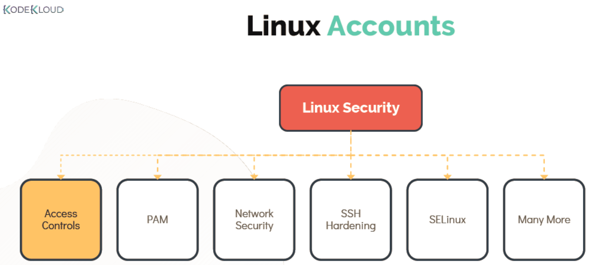
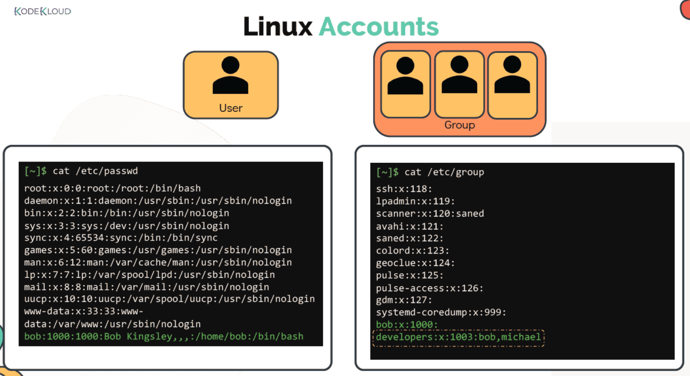
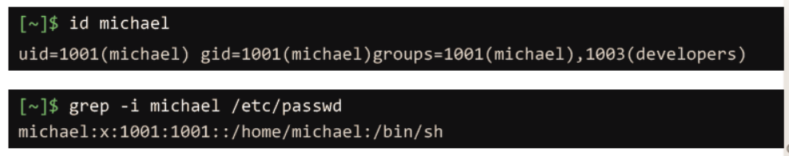
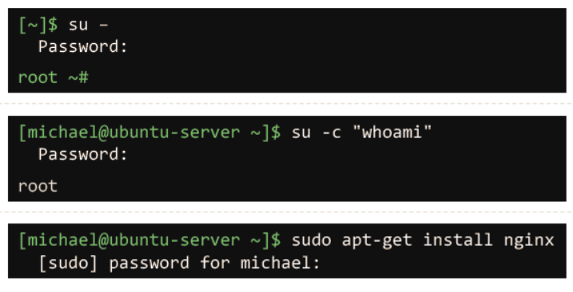
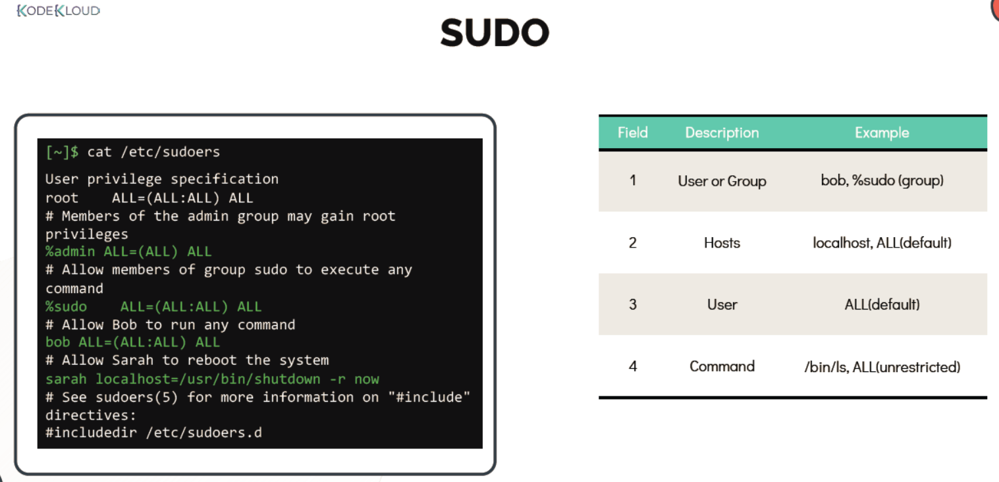

# LINUX ACCOUNTS

  - Take me to the [Tutorial](https://kodekloud.com/topic/linux-accounts/)
  - In this section we will take a look at basic access control in Linux.
  - We will also learn about about the file permissions. Lets Get Started!

    


  #### User Accounts

  - User's informations are stored under **`/etc/passwd`** file.

    ```
    [~]$ cat /etc/passwd
    ```

  - Information about groups is stored into  **`/etc/group`** file.

    ```
    [~]$ cat /etc/group
    ```
   
    
    
  - Each user has a username and a unique ID assigned to them known as user ID or UID.
  - The user also has a GID, the group id they are part of, **`id`** command can be use to check these details. for eg:

    ```
    [~]$ id michael
    uid=1001(michael) gid=1001(michael)groups=1001(michael),1003(developers)
    ```
  
  - More details about the user account can be found eg. default shell, home directory using.

    ```
    [~]$ grep -i michael /etc/passwd
    michael:x:1001:1001::/home/michael:/bin/sh
    ```
   
    

  - To see the list of users currently logged use **`who`** command.

    ```
    [~]$ who
    bob pts/2 Apr 28 06:48 (172.16.238.187)
    ```

  - The **`last`** command displays the record of all logged-in users along with the date and time when the system was rebooted.

    ```
    [~]$ last
    michael :1 :1 Tue May 12 20:00 still logged in
    sarah :1 :1 Tue May 12 12:00 still running
    reboot system boot 5.3.0-758-gen Mon May 11 13:00 - 19:00 (06:00)
    ```

  #### Switching users

  - To switch to any user use **`su`** command.

    ```
    [~]$ su –
    Password:

    root ~#
    ```
 
  - To run a specific command you can use **`su -c "whoami"`** (This is not recommended way)

    ```
    [michael@ubuntu-server ~]$ su -c "whoami"
    Password:
    root
    ```

  - To run a command as a root user **`sudo`** command is recommended.

    ```
    [michael@ubuntu-server ~]$ sudo apt-get install nginx
    [sudo] password for michael:
    ``` 
    
    

  - Users listed in /etc/sudoers file can make use of sudo command for privledge escalation.

    ```
    [~]$ cat /etc/sudoers
    ```
    

  - To restrict anyone from directly login as root login, this can be done by setting **`nologin`** shell.

    ```
    [~]$ grep -i ^root /etc/passwd
    /root:x:0:0:root:/root:/usr/sbin/nologin
    ```
    