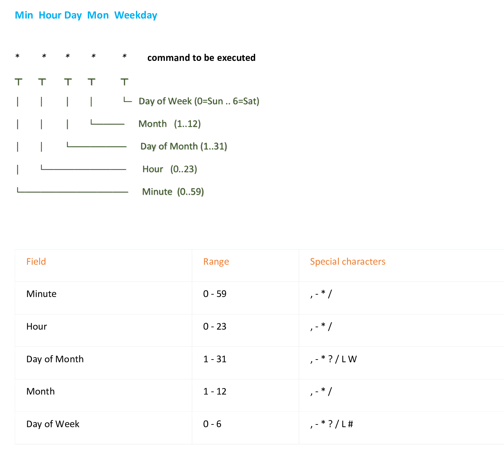
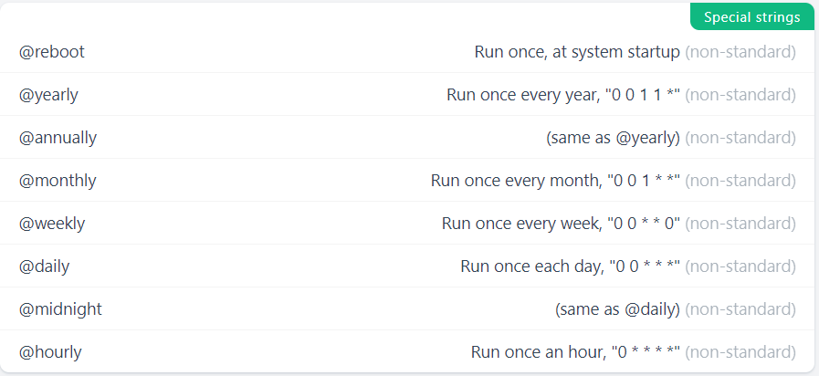
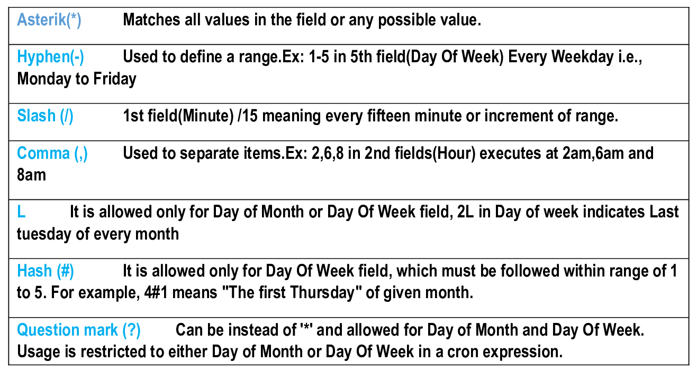
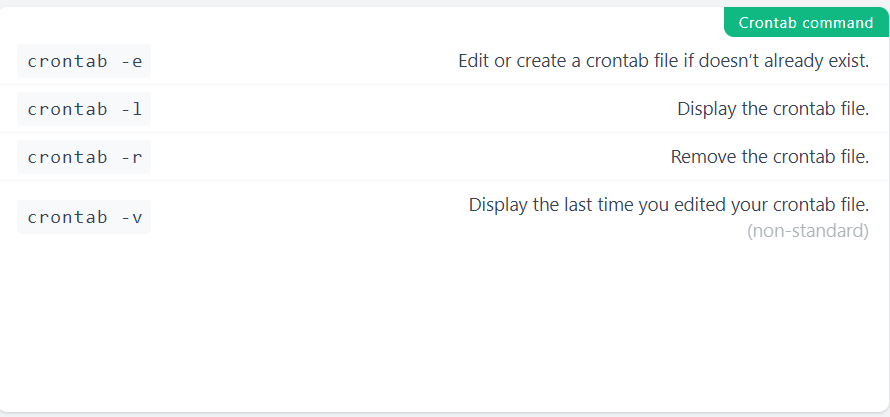

# Cronjob in Linux

  - Take me to the [Tutorial](https://kodekloud.com/courses/873064/lectures/24032686)
  - In this lecture we will learn about **Cronjobs** in Linux .

The basic usage of **cron** is to execute a job in a specific time. The **`crontab`** is a list of commands that you want to run on a regular schedule, and also the name of the command used to manage that list. **Crontab** stands for **`cron table`** because it uses the job scheduler cron to execute tasks. The schedule is called the crontab, which is also the name of the program used to edit that schedule.

## Linux Crontab Format

   

### Expressions used and Description

   
   
   

#### Crontab commands

    
   
	 

##### Crontab Examples

*/30 * * * *	Every 30 mins

0 * * * *	Every hour

0 0 * * 0	At midnight of every Sunday

0 0 0 15 * *	Every 15th of month (monthly)

0 0 0 1 1 *	Every 1st of january (yearly)

@reboot	        Every reboot
