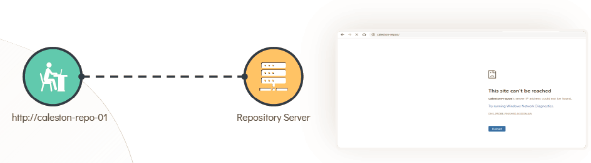
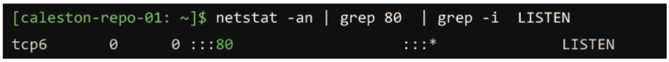
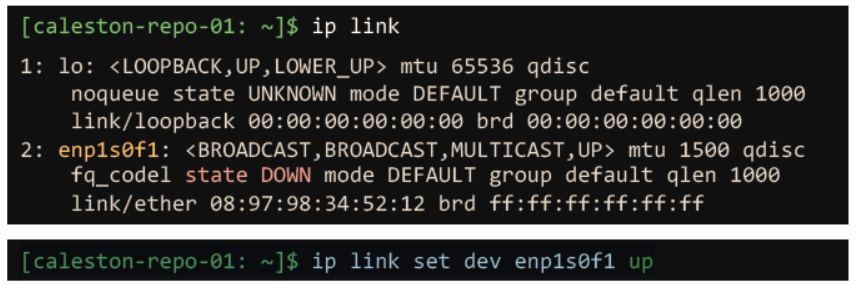

# TROUBLESHOOTING 

  - Take me to the [Tutorial](https://kodekloud.com/topic/troubleshooting/)

  - In this lecture we will be going to troubleshooting the issue that **`Bob`** is facing.
  - Bob is not able to reach to the repository server and he get the error as show below.

    

  #### Check Interfaces

  - Use the **`ip link`** to ensure the primary interface is up.
  - In this case, the network interface named **`enp1s0f1`** state is up.

    ```
    [~]$ ip link
    1: lo: <LOOPBACK,UP,LOWER_UP> mtu 65536 qdisc
        noqueue state UNKNOWN mode DEFAULT group default qlen 1000
        link/loopback 00:00:00:00:00:00 brd 00:00:00:00:00:00
    2: enp1s0f1: <BROADCAST,BROADCAST,MULTICAST,UP> mtu 1500 qdisc
        fq_codel state UP mode DEFAULT group default qlen 1000
        link/ether 08:97:98:6e:55:4d brd ff:ff:ff:ff:ff:ff
    ```

  - Check if we can resolve the hostname to IP address via **`nslookup`**

    ```
    [~]$ nslookup caleston-repo-01
    Server:      192.168.1.100
    Address:     192.168.1.100 #53

    Non-authoritative answer:
    Name: caleston-repo-01
    Address: 192.168.2.5
    ```

  - **`ping`** to check the connectivity.

    ```
    [~]$ ping caleston-repo-01
    PING caleston-repo-01 (192.168.2.5) 56(84) bytes of data.

    --- localhost ping statistics ---
    3 packets transmitted, 0 received, 100% packet loss, time 2034ms
    ```
 
  - **`traceroute`** to check the number of hops between the source. 

    ```
    [~]$ traceroute 192.168.2.5

    Tracing route to example.com [192.168.2.5]
    over a maximum of 30 hops:
    1 <1 ms <1 ms <1 ms 192.168.1.1
    2 <2 ms <1 ms <1 ms 192.168.2.1
    3 * * * Request timed out.
    ```

  - To check the port status use **`netstat`** command and to use it along with port number use below command.

    ```
    [caleston-repo-01: ~]$ netstat -an | grep 80 | grep -i LISTEN
    ```

    
    
  - To bring up the interface up use below command.

    ```
    [caleston-repo-01: ~]$ ip link set dev enp1s0f1 up
    ```

    