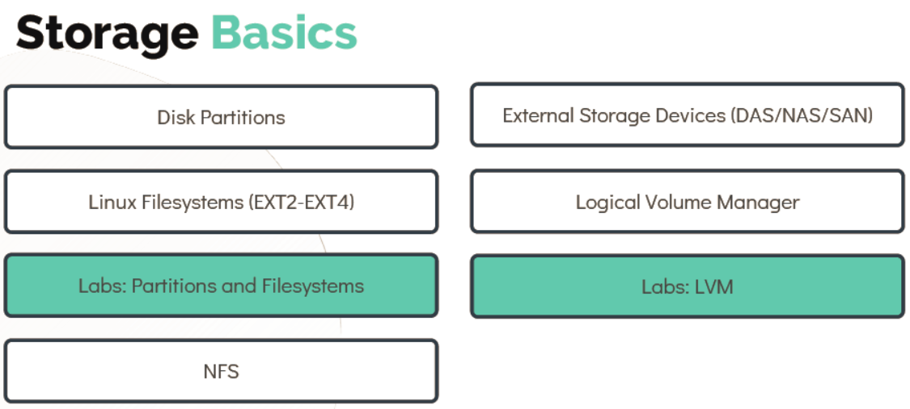
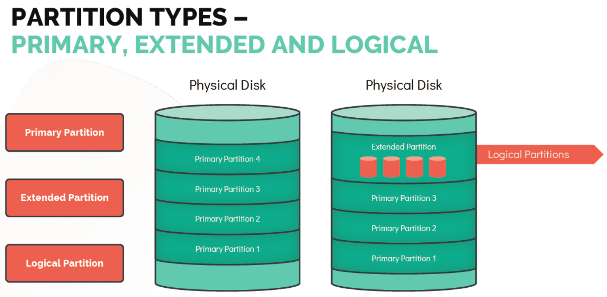

# DISK'S & PARTITIONS

- Take me to the [Tutorial](https://kodekloud.com/topic/disk-partitions/)

- In this lecture we will learn about Disk Partitions. 
- We will look at the File Systems such as EXT series and NFS.
- External Storage Devices such as DAS,NAS, and SAN.
- LVM in Action.

  
  
  #### List all Block devices
  
  - Block devices are special files that refer to or represent a device (which could be anything from a hard drive to a USB drive). So naturally, there are command line tools that help you with your block devices-related work.
  - Major Number is used to identigy the type of block device, value 8 represent a SCSI device starts with SD.
  - Minor Number is uset to distuinguish individual, physical or logical devices.

     ```
     [~]$ lsblk 
     ```

     ```
     [~]$ ls -l /dev/ | grep "^b"
     ```

  - To Print,Create and Delete the parition table use **`fdisk -l`** command 
 
     ```
     [~]$ sudo fdisk -l /dev/sda
     ```

  #### Partition Types - 
  
  

  - PRIMARY - Use to Boot an Operating System.
  - EXTENDED - Can host logical partitions but cannot be used on its own.
  - LOGICAL - Created within an extended partition.

  #### Creating Partitions - 

  - **`Gdisk`** is an improved version of the **`fdisk`** that works with the GTP partition table.
  - To create a partition on **`sdb`** use
     
    ```
    [~]$ gdisk /dev/sdb
    GPT fdisk (gdisk) version 1.0.1

    Partition table scan:
      MBR: protective
      BSD: not present
      APM: not present
      GPT: present
    Found valid GPT with protective MBR; using GPT.
    
    Command (? for help): ?
    b back up GPT data to a file
    c change a partition's name
    d delete a partition
    i show detailed information on a partition
    l list known partition types
    n add a new partition
    o create a new empty GUID partition table (GPT)
    p print the partition table
    q quit without saving changes
    r recovery and transformation options (experts only)
    s sort partitions
    t change a partition's type code
    v verify disk
    w write table to disk and exit
    x extra functionality (experts only)
    ? print this menu

    Command (? for help): n
    Partition number (1-128, default 1): 1
    First sector (34-41943006, default = 2048) or {+-}size{KMGTP}: 2048
    Information: Moved requested sector from 34 to 2048 in
    order to align on 2048-sector boundaries.
    Use 'l' on the experts' menu to adjust alignment
    Last sector (2048-41943006, default = 41943006) or {+-}size{KMGTP}: 41943006
    Current type is 'Linux filesystem'
    Hex code or GUID (L to show codes, Enter = 8300):
    Changed type of partition to 'Linux filesystem'
    Command (? for help): w
    Final checks complete. About to write GPT data. THIS WILL OVERWRITE EXISTING
    PARTITIONS!!
    Do you want to proceed? (Y/N): Y
    OK; writing new GUID partition table (GPT) to /dev/vdb.
    The operation has completed successfully.
    ```

    ```
    [~]$ sudo fdisk -l /dev/sdb
    Disk /dev/sdb: 20 GiB, 128035676160 bytes, 250069680 sectors
    Units: sectors of 1 * 512 = 512 bytes
    Sector size (logical/physical): 512 bytes / 512 bytes
    I/O size (minimum/optimal): 512 bytes / 512 bytes
    Disklabel type: gpt
    Disk identifier: 7CABF26E-9723-4406-ZEA1-C2B9B6270A23
    Device Start End Sectors Size Type
    /dev/sdb1 2048 41943006 204800 20GB Linux filesystem
    ```

 # HANDS-ON LABS

   -  [Troubleshoot](https://kodekloud.com/courses/873064/lectures/17074602) why **`Bob's`** System is not displaying the entire size of the physical disk