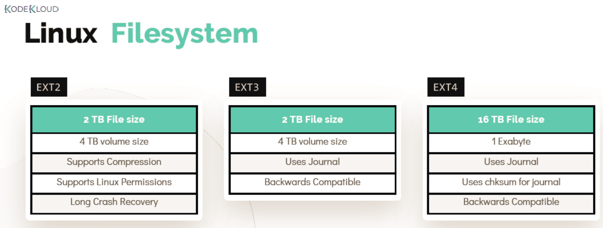
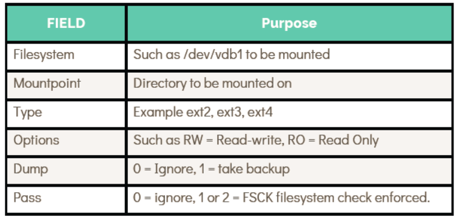

# File System in Linux

  - Take me to the [Tutorial](https://kodekloud.com/topic/file-systems-in-linux/)

  - In this lecture we will cover the most commonly used file systems from EXT2 to EXT4.
  
    

  #### Working with Ext4 

  - To create a file system we will make use of **`/dev/sdb`** disk, run below command 

    ```
    [~]$ mkfs.ext4 /dev/sdb1
    ```

  - Now create a directory to mount the filesystem use below commands

    ```
    [~]$ mkdir /mnt/ext4;

    [~]$ mount /dev/sdb1 /mnt/ext4
    ```    
  - To verify if the filesystem is mounted use 

    ```
    [~]$ mount | grep /dev/sdb1

    [~]$ df -hP | grep /dev/sdb1
    ```
  - Add an entry into **`/etc/fstab`** for the filesystem to be available after reboot.

    ```
    # /etc/fstab: static file system information.
    #
    # Use 'blkid' to print the universally unique identifier for a
    # device; this may be used with UUID= as a more robust way to name devices
    # that works even if disks are added and removed. See fstab(5).
    #
    # <file system> <mount point> <type> <options> <dump> <pass>
    /dev/sda1 / ext4 defaults,relatime,errors=panic 0 1 ~
    ```

    ```
    echo "/dev/sdb1 /mnt/ext4 ext4 rw 0 0" >> /etc/fstab
    ```
  - **`fstab`** file attributes

    

# HANDS-ON LABS

  - Lets Play around with [FileSystems](https://kodekloud.com/courses/873064/lectures/17074604)