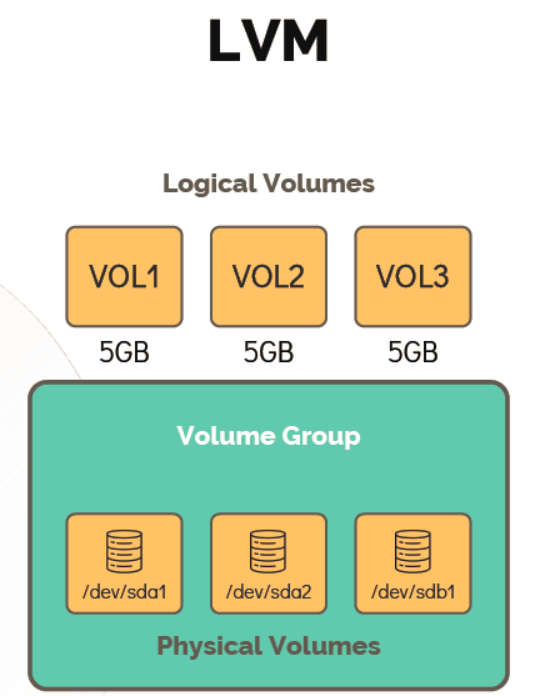
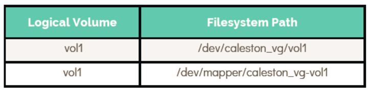

# LOGICAL VOLUME MANAGER

 - Take me to the [Tutorial](https://kodekloud.com/topic/lvm/)
 
 - LVM allows grouping of multiple physical volumes, which are hard disks or partitions into a volume group.
 - Volumegroups can be carve out logical volumes.

   

  #### Working with LVM

  - To make use of LVM, install the package **`LVM`** .

    ```
    [~]$ apt-get install lvm2
    ```

  - Use **`pvcreate`** command to create a Physical Volume.

    ```
    [~]$ pvcreate /dev/sdb
    Physical volume "/dev/sdb" successfully created
    ```

  - Use **`vgcreate`** command to create a Volume Group.

    ```
    [~]$ vgcreate caleston_vg /dev/sdb
    Volume group "caleston_vg" successfully created
    ```

  - Use **`pvdisplay`** command to list all the PVs their names, size and the Volume group it is part of.

    ```
    [~]$ pvdisplay
    --- Physical volume ---
      PV Name /dev/sdb
      VG Name caleston_vg
      PV Size 20.00 GiB / not usable 3.00 MiB
      Allocatable yes
      PE Size 4.00 MiB
      Total PE 5119
      Free PE 5119
      Allocated PE 0
      PV UUID iDCXIN-En2h-5ilJ-Yjqv-GcsR-gDfV-zaf66E
    ```

  - Use **`vgdisplay`**  to see more details of the VG. 

    ```
    [~]$ vgdisplay
    --- Volume group ---
      VG Name caleston_vg
      System ID
      Format lvm2
      Metadata Areas 1
      Metadata Sequence No 1
      VG Access read/write
      VG Status resizable
      MAX LV 0
      Cur LV 0
      Open LV 0
      Max PV 0
      Cur PV 1
      Act PV 1
      VG Size 20.00 GiB
      PE Size 4.00 MiB
      Total PE 5119
      Alloc PE / Size 0 / 0
      Free PE / Size 5119 / 20.00 GiB
      VG UUID VzmIAn-9cEl5bA-lVtm-wHKX-KQaObR
    ```
    
  - To create the Logical Volumes, you can use **`lvcreate`** command

    ```
    [~]$ lvcreate –L 1G –n vol1 caleston_vg
    Logical volume "vol1" created.
    ```

  - To display the Logical Volumes, you can use **`lvdisplay`** command

    ```
    [~]$ lvdisplay
    --- Logical volume ---
      LV Path /dev/caleston_vg/vol1
      LV Name vol1
      VG Name caleston_vg
      LV UUID LueYC3-VWpE31-UaYk-wjIR-FjAOyL
      LV Write Access read/write
      LV Creation host, time master, 2020-03-31 06:26:14
      LV Status available
      # open 0
      LV Size 1.00 GiB
      Current LE 256
      Segments 1
      Allocation inherit
      Read ahead sectors auto
      - currently set to 256
      Block device 252:0
    ```

  - To list the volume, you can use **`lvs`** command

    ```
    [~]$ lvs
     LV VG Attr LSize Pool
     vol1 caleston_vg -wi-a----- 1.00g
    ```
 
  - Now to create an filesystem you can use **`mkfs`** command

    ```
    [~]$ mkfs.ext4 /dev/caleston_vg/vol1
    ```

  - To mount the filesystem use **`mount`** command

    ```
    [~]$ mount –t ext4 /dev/caleston_vg/vol1 /mnt/vol1
    ```

  - Now logical volume is now available for use. Lets resize the filesystem on vol1 while it is mounted. Check the free space available.

    ```
    [~]$ vgs
    VG #PV #LV #SN Attr VSize VFree
    caleston_vg 1 1 0 wz--n- 20.00g 19.00g
    ```

    ```
    [~]$ lvresize -L +1G -n /dev/caleston_vg/vol1
    Logical volume vol1 successfully resized.
    ```

    ```
    [~]$ df –hP /mnt/vol1
    Filesystem Size Used Avail Use% Mounted on
    /dev/mapper/caleston_vg-vol1 976M 1.3M 908M 1% /mnt/vol1
    ```

  - Now to resize the file system use **`resize2fs`** command.

    ```
    [~]$ resize2fs /dev/caleston_vg/vol1
    resize2fs 1.42.13 (17-May-2015)
    Filesystem at /dev/mapper/caleston_vg-vol1 is mounted on
    /mnt/vol1; on-line resizing required
    old_desc_blocks = 1, new_desc_blocks = 1
    The filesystem on //dev/mapper/caleston_vg-vol1 is now 524288
    (4k) blocks long.
    ```

   - Now run **`df -hp`** command to verify the size of the mounted filesystem

     ```
     [~]$ df –hP /mnt/vol1
     Filesystem Size Used Avail Use% Mounted on
     /dev/mapper/caleston_vg-vol1 2.0G 1.6M 1.9G 1% /mnt/vol1
     ```

     

# HANDS-ON LABS

  - Lets head over to the hands-on labs of [LVM](https://kodekloud.com/courses/873064/lectures/17074607)