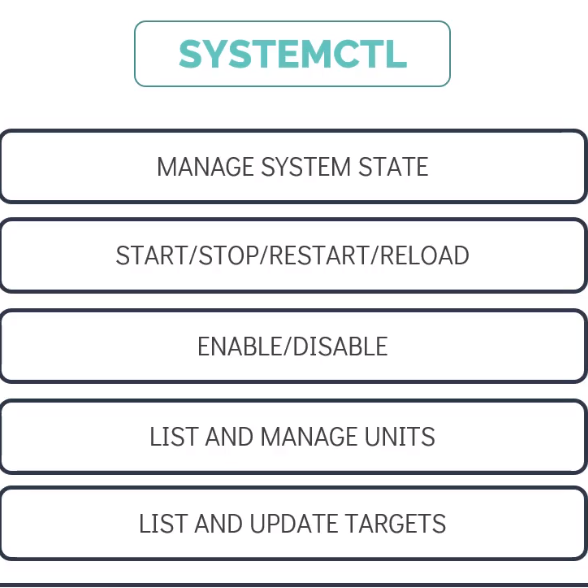
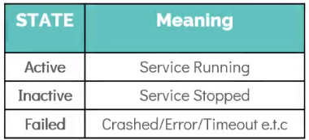

# SYSTEMD Tools to Manage SYSTEMD service

  - Take me to the [Tutorial](https://kodekloud.com/topic/systemd-tools/)

  In this lecture we will explore two major SYSTEMD tools:
  - SYSTEMCTL
  - JOURNALCTL

  ## SYSTEMCTL

   - __Systemctl__ is the main command used to manage services on a **`SYSTEMD`** managed server.
   - It can be used to manage services such as **`START/STOP/RESTART/RELOAD`** as well as **`ENABLE/DISABLE`** services
     during the system boot.
   - It is also used to **`LIST AND MANAGE UNITS`** and **`LIST AND UPDATE TARGETS`**

      

### Systemctl Commands

- To start a service use the start command, for example to start a docker service use **`systemctl start docker`**

  ```
  [~]$ systemctl start docker
  ```

- To stop a service use the stop command, for example to stop a docker service use **`systemctl stop docker`**

  ```
  [~]$ systemctl stop docker
  ```
- To restart a service use the restart command, for example to restart a docker service use **`systemctl restart  docker`** this will stop and start again.

  ```
  [~]$ systemctl restart docker
  ```
- To reload a service use the reload command, for example to reload a docker service use **`systemctl reload docker`**, this will reload all the configuration without interrupting the normal functionaltiy of the service

  ```
  [~]$ systemctl reload docker
  ```
- To enable a service and make it persistent accross reboots use the enable command, for example to enable a docker service use **`systemctl enable docker`**

  ```
  [~]$ systemctl enable docker
  ```

- To disable a service at boot use the disable command, for example to disable a docker service use **`systemctl disable docker`** command.

  ```
  [~]$ systemctl disable docker
  ```

- To know the status of the service use **`systemctl status docker`** command. This command provided the state of the service. If running properly is should show **`active (running)`** state as shown in screenshot below.

  ```
  [~]$ systemctl status docker
  ```

- Besides **`active (running)`** state there are few other state that you should be aware off.

  

- Running **`systemctl daemon reload`** command after making changes to service unit file reloads the system manager configuration and makes the systemd aware of the changes.

- To edit the service file use command **`systemctl edit project-mercury.service --full`** this will open a text editor, you can make the changes and re-write the settings as needed, making changing this way applied immediately without running the **`systemctl daemon reload`** command

  ```
  [~]$ systemctl daemon-reload
  [~]$ systemctl edit project-mercury.service --full
  ```
- To see the current runlevel use **`systemctl get-default`**

  ```
  [~]$ systemctl get default
  ```

- To change the runleve to a different target use  **`systemctl set-default multi-user.target`**

  ```
  [~]$ systemctl set-default multi-user.target
  ```

- To list all the units that systemd has loaded use **`systemctl list-units --all`**, this lists all the unit which are active, inactive or anyother state.

  ```
  [~]$ systemctl list-units --all
  ```

- To list only active units use **`systemctl list-units`** command

  ```
  [~]$ systemctl list-units
  ```

- To view, and also locate a unit file use **`systemctl cat`** command. A comment line containing the path to the unit file is printed as the first line of output.

  ```
  [~]$ systemctl cat project-mercury.service
  ```

## JOURNALCTL

  - __Journalctl__ is a command for quering/viewing logs collected by systemd.
  - The systemd-journald service is responsible for systemd’s log collection, and it retrieves messages from the kernel    systemd services, and other sources.
  - Very useful when you are troubleshooting issues with systemd services.

    

  - Using **`journalctl`** commands print all the log entries from oldest to the newest.

    ```
    [~]$ journalctl
    ```
  - Using **`journalctl -b`** command print all the logs from the current boot.

    ```
    [~]$ journalctl -b
    ```
  - Using **`journalctl -u docker.service`** command print all the logs specific to the unit specified, for example docker in this case.

    ```
    [~]$ journalctl -u docker.service
    ```

  - Using **`journalctl -u docker.service --since`** command print all the logs specific to the unit specified since the given time, for example docker in this case.

    ```
    [~]$ journalctl -u docker.service --since "2022-01-01 13:45:00"
    ```

## HANDS-ON LABS

  - Now lets troubleshoot and help **`Bob`** [Let's Help Bob](https://kodekloud.com/courses/the-linux-basics-course/lectures/17074647)